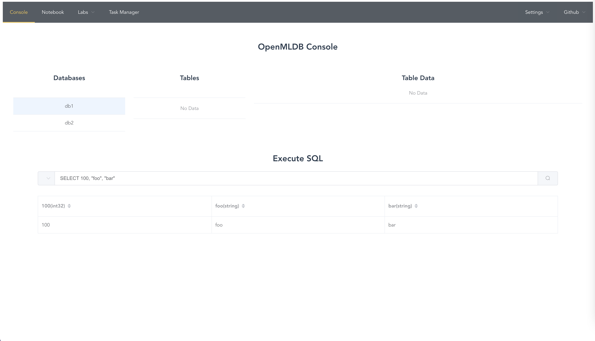
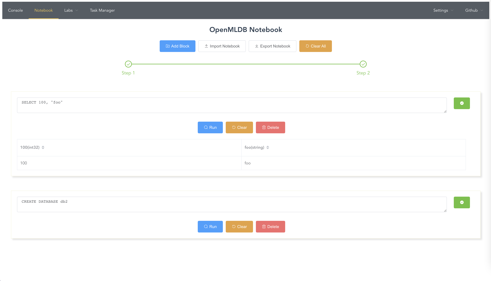
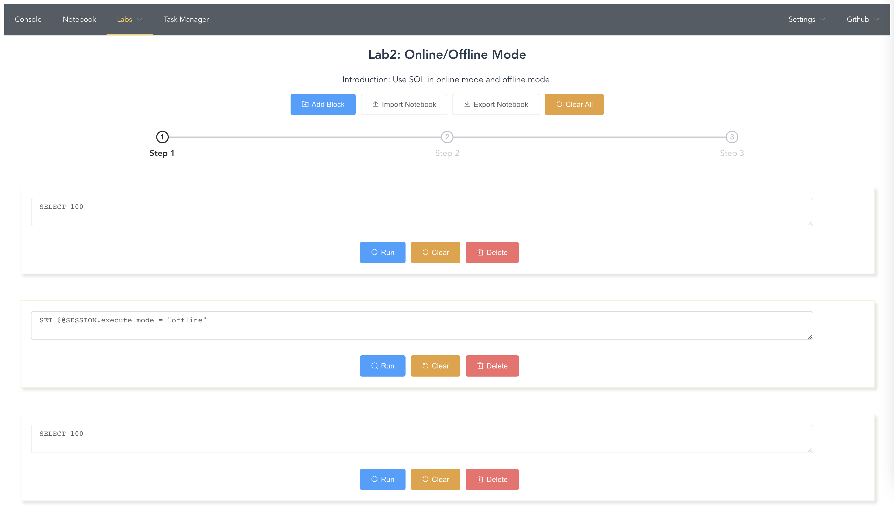
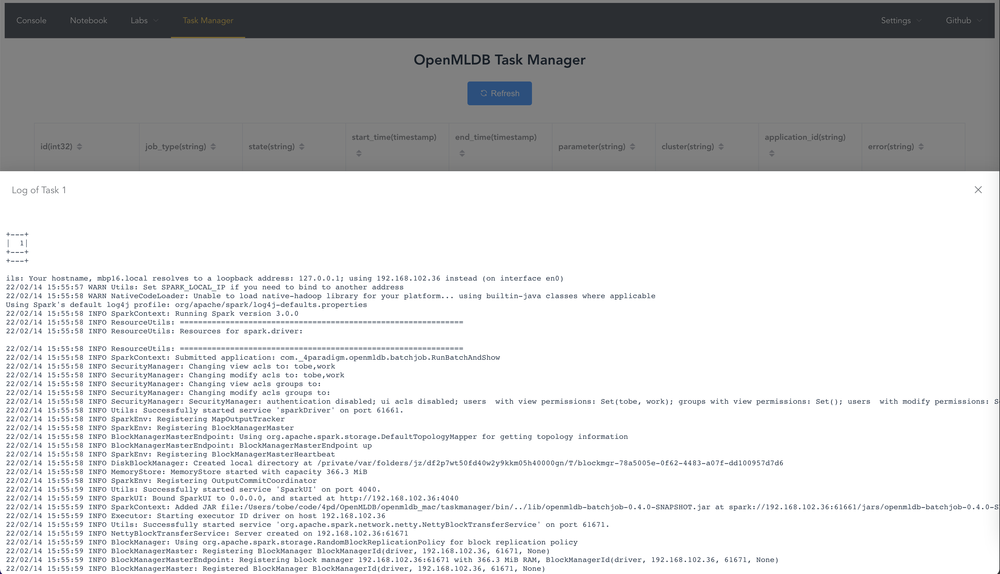

# OpenMLDB Lab

## Introduction

The web service of [OpenMLDB](https://github.com/4paradigm/openmldb) which provides out-of-box features. Visit [openmldb.online](http://openmldb.online/) for live demo.

* **Console**: Visually display databases, tables and rows
* **Playground**: Execute SQL online without configuring
* **Notebook**: Import and export notebooks for sharing
* **Labs**: Entry-level and practical labs for beginners
* **SQL Debugger**: Analyse and parse OpenMLDB SQL easily
* **Task Management**: Visually display tasks and show logs






## Install

Install with official Python package [popenmldb_lab](https://pypi.org/project/openmldb-lab/).

```
pip install openmldb_lab
```

Or build from scratch with source code.

```
git clone https://github.com/tobegit3hub/openmldb_lab.git

cd ./openmldb_lab/

./install.sh
```

## Usage

Run `openmldb_lab` with OpenMLDB cluster.

```
openmldb_lab --zk=0.0.0.0:2181 --zk_path=/openmldb
```

Or use environment variables.

```
ZK=0.0.0.0:2181 ZK_PATH=/openmldb openmldb_lab
```

Then open browser in <http://127.0.0.1:7788>.

Run `openmldb_lab -h` for more options.

```
$ openmldb_lab -h
usage: openmldb_lab [-h] [--host HOST] [--port PORT] [--zk ZK] [--zk_path ZK_PATH] [--default_db DEFAULT_DB] [--debug DEBUG]

optional arguments:
  -h, --help            show this help message and exit
  --host HOST           The host of the server(eg. 0.0.0.0)
  --port PORT           The port of the server(eg. 7788)
  --zk ZK               The ZooKeeper cluster(eg. 0.0.0.0:2181)
  --zk_path ZK_PATH     The ZK path of OpenMLDB cluster(eg. /openmldb)
  --default_db DEFAULT_DB
                        The default database(eg. default_db)
  --debug DEBUG         Enable debug for flask or not(eg. true)
```

## Docker Image

Run with official Docker image [tobegit3hub/openmldb_lab](https://hub.docker.com/r/tobegit3hub/openmldb_lab).

```
docker run -d --net=host -e ZK=0.0.0.0:2181 -e ZK_PATH=/openmldb tobegit3hub/openmldb_lab
```

Notice that `--net=host` does not work in MacOS, refer to <https://docs.docker.com/network/host/>. Please use `pip install openmldb_lab` or build from scratch in MacOS.

## Development

Front-end uses [Vue.js](https://vuejs.org/) in JavaScript and we can start front-end directly.

```
cd ./vueapp/

npm run serve
```

Make sure to set the back-end host in <./vueapp/src/components/Global.vue>.

Back-end uses [Flask](https://flask.palletsprojects.com/) in Python and we can start the server.

```
cd ./openmldb_server/

./server.py --debug=true
```

OpenMLDB Lab accesses OpenMLDB cluster with [OpenMLDB Python SDK](https://pypi.org/project/openmldb/).

## License

[Apache License](./LICENSE)
