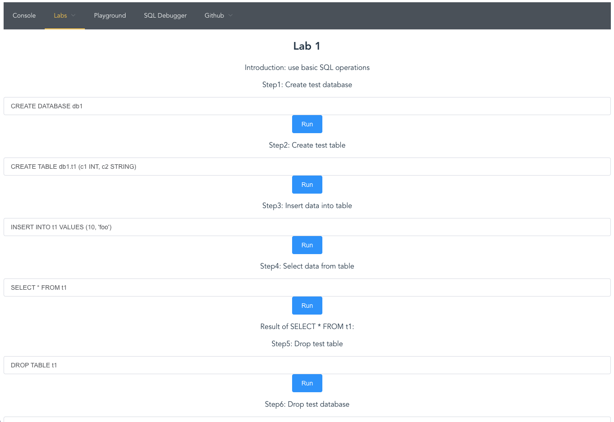

# OpenMLDB Lab

## Introduction

The web service of [OpenMLDB](https://github.com/4paradigm/openmldb) which provides battery-included features.

* Web Console of OpenMLDB databases
* Playground of OpenMLDB SQL
* Multiple labs for beginners
* SQL debugger of OpenMLDB SQL
* Task management service for tasks

## Install

Use the official Python package [popenmldb_lab](https://pypi.org/project/openmldb-lab/).

```
pip install openmldb_lab
```

Use the official Docker image [tobegit3hub/openmldb_lab](https://hub.docker.com/r/tobegit3hub/openmldb_lab).

```
docker pull tobegit3hub/openmldb_lab
```

Build from scratch with source code.

```
git clone https://github.com/tobegit3hub/openmldb_lab.git

cd ./openmldb_lab/

./install.sh
```

## Usage

Run with pre-built binary.

```
openmldb_lab --zk=0.0.0.0:2181 --zk_path=/openmldb
```

Or use environment variables.

```
ZK=0.0.0.0:2181 ZK_PATH=/openmldb openmldb_lab
```

Run with Docker image.

```
docker run --net host -e ZK=0.0.0.0:2181 -e ZK_PATH=/openmldb tobegit3hub/openmldb_lab
```

Then open browser in <http://127.0.0.1:7788>.



## Development

Front-end uses [Vue.js](https://vuejs.org/) in JavaScript and we can start front-end directly.

```
cd ./vueapp/

npm run serve
```

Back-end uses [Flask](https://flask.palletsprojects.com/) in Python and we can start the server.

```
cd ./openmldb_server/

FLASK_ENV=development FLASK_APP=server flask run --port 7788
```

Access OpenMLDB with [OpenMLDB Python SDK](https://pypi.org/project/openmldb/).

## License

[Apache License](./LICENSE)
